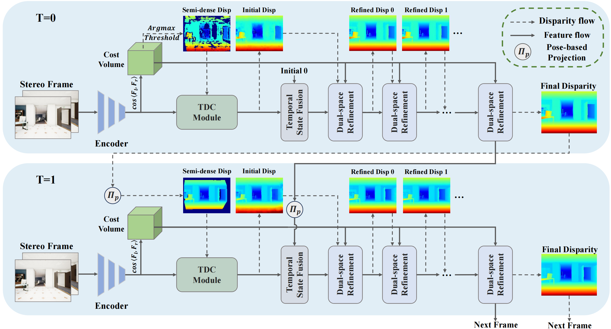

# [ECCV2024] Temporally Consistent Stereo Matching

## News

- **2024.07.06**: The code will be uploaded in a few weeks.
- **2024.07.17**: The [paper](https://arxiv.org/pdf/2407.11950) and [supplementary materials](./pdf/Temporally_Consistent_Stereo_Matching_supp.pdf) are available now.
- **2024.07.22**: The code is available now. Video demos are coming soon.
- **2024.09.26**: Video demos are available now.

## Pipeline


## Visualization
- **TartanAir**:


- **KITTI**:


## Installation

Our code is based on CUDA 11.7 and PyTorch 2.0.1. We recommend using Anaconda to create a new environment:

```bash
conda create -n tcstereo python=3.8
conda activate tcstereo
```

Then, install the dependencies:

```bash
pip install -r requirements.txt
```

## Dataset

We use the [TartanAir](https://github.com/castacks/tartanair_tools), [SceneFlow](https://lmb.informatik.uni-freiburg.de/resources/datasets/SceneFlowDatasets.en.html), and [Raw data of KITTI](https://github.com/youmi-zym/TemporalStereo?tab=readme-ov-file#kitti-20122015) datasets in our experiments. Please download the datasets and organize them as follows:

```
datasets
├── TartanAir
│   ├── abandonedfactory
│   │   ├── abandonedfactory
│   │   │   ├── Easy
│   │   │   │   ├── P000
│   │   │   │   │   ├── depth_left
│   │   │   │   │   ├── image_left
│   │   │   │   │   ├── image_right
│   │   │   │   │   ├── pose_left.txt
│   │   │   │   ├── ...
│   │   │   ├── Hard
│   │   │   │   ├── ...
│   ├── ...
├── Driving
│   ├── frames_cleanpass
│   ├── frames_finalpass
│   ├── disparity
│   ├── pose
├── FlyingThings3D
│   ├── frames_cleanpass
│   ├── frames_finalpass
│   ├── disparity
│   ├── pose
├── Monkaa
│   ├── frames_cleanpass
│   ├── frames_finalpass
│   ├── disparity
│   ├── pose
├── kitti_raw  # training sequences & pesudo labels, the pose files are generated by core/utils/preprocess_kitti_raw_pose.py
│   ├── 2011_09_26
│   ├── ...
├── KITTI  # testing sequences
│   ├── kitti_seq
│   │   ├── kitti2015_testings
│   │   │   ├──000000
│   │   │   ├── ...
```

## Checkpoints

We provide the trained models on TartanAir, SceneFlow, and KITTI_raw datasets. Please download the checkpoints from [Dropbox](https://www.dropbox.com/scl/fo/ut5uvvispo82prjct67j5/AAe173vjhLhV5VdlKa-Vt7M?rlkey=eba6jrym9fqz4lfehj5zy0mk7&st=eh9gfxrw&dl=0).

## Evaluation

Before evaluation, please download the checkpoints and put them in the `./checkpoints` directory.

You can evaluate the pre-trained models on TartanAir, SceneFlow, and KITTI_raw datasets by running the following scripts:

```bash
bash tartanair_evaluate.sh
```

```bash
bash sceneflow_evaluate.sh
```

```bash
bash submit_kitti.sh
```

## Training

For TartanAir dataset, you can train the model by running the following script:
```bash
bash tartanair_ddp_train.sh
```

For SceneFlow dataset, you can train the model by running the following script:
```bash
bash sceneflow_ddp_train.sh
```

For KITTI_raw dataset, you can train the model based on the pre-trained model on TartanAir dataset by running the following script:
```bash
bash KITTI_ddp_train.sh
```

## Acknowledgement

Our code is based on [RAFT-Stereo](https://github.com/princeton-vl/RAFT-Stereo), [TemporalStereo](https://github.com/youmi-zym/TemporalStereo?tab=readme-ov-file#kitti-20122015), [IGEV-Stereo](https://github.com/gangweiX/IGEV) and [HITNet](https://arxiv.org/abs/2007.12140). We thank the authors for their great works.

## Citation

If you find our work useful in your research, please consider citing:

```bibtex
@article{zeng2024temporally,
  title={Temporally Consistent Stereo Matching},
  author={Zeng, Jiaxi and Yao, Chengtang and Wu, Yuwei and Jia, Yunde},
  booktitle={European Conference on Computer Vision (ECCV)},
  year={2024}
}
```
